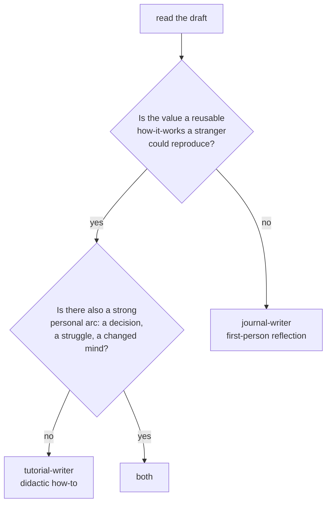

# journal-router

The garden has two voices. This skill reads a draft and decides which one a post should use, then
hands off to the skill that writes it. It classifies and dispatches; it does not write.

- [tutorial-writer] — didactic, hands-on, reader-centric. Teaches how a tool or technique works.
- [journal-writer] — first-person reflection, author-centric. Recounts an experience and what it
  taught.

## Input

- Source: `~/garden/drafts/YYYY-MM/DD_HHMMSS.md` (raw session captures, grouped by month), or the
  entry list in `~/garden/drafts/YYYYMMDD-journal-plan.md` produced by `/drafts`.
- For a given entry, read only the drafts assigned to it, then classify.

## The decision

Read the draft and score it against both columns. The dominant column wins.

| Signal | Tutorial voice | Journal voice |
| --- | --- | --- |
| What carries the value | a reusable technique or mental model | the author's experience or decision |
| Reproducibility | a stranger can follow it and get the same result | it is specific to what happened to me |
| Point of view | mostly imperative / second person | first person, "I tried / I was wrong / I now think" |
| Emotional content | none; it teaches | present; confusion, surprise, a changed mind |
| Natural title | "How X works", "X by doing it" | "What X taught me", "Why I switched" |
| The artifact's role | the output IS the lesson | the output grounds a story |

## The "both" rule

A draft can hold a strong technique AND a strong personal arc (e.g. "I built a local Ralph loop"
teaches the loop AND recounts the decision to trust a small model unwatched). When both are strong:

- **Default: split into two posts.** One tutorial that teaches the technique cleanly, one reflection
  that tells the experience. Each stays in a single voice; neither gets muddied. Cross-link them
  with wikilinks.
- **Blend into one only when the arcs cannot stand alone.** If the technique is too thin for its own
  post, write one post in the **dominant** voice and let the other flavor season it lightly. Do not
  alternate voices paragraph to paragraph.

When in doubt, prefer two clean single-voice posts over one blended post.

## Dispatch

1. Decide the voice(s) from the table and the flow above.
2. Load the chosen skill(s): `tutorial-writer` and/or `journal-writer` from
   `~/.me/claude/skills/<name>/SKILL.md`.
3. Write each post following that skill's voice, structure, and guardrails.
4. Save to `~/garden/journal/YYYY-MM-DD-descriptive-slug.md` (the real content dir; the slug is the
   lowercased, hyphenated title). Set `draft: true`.
5. For a "both" split, write two files and add a wikilink from each to the other.
6. Report the classification and the reason, so the human can override before publish.

## Edge cases

- **Trivial or context-free draft:** if it teaches nothing reusable and reflects nothing worth
  keeping, mark it skippable and do not force a post.
- **Ambiguous:** state the call and the runner-up in the report, so the human can flip it.
- **Series:** if a draft continues a prior post, keep the same voice as that post for consistency
  and cross-link them.
